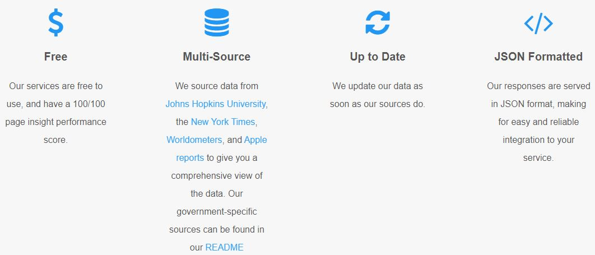
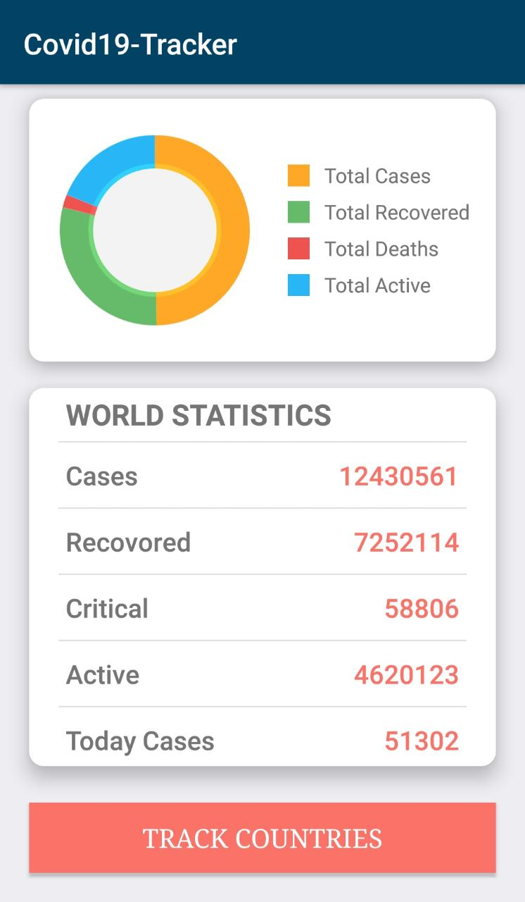
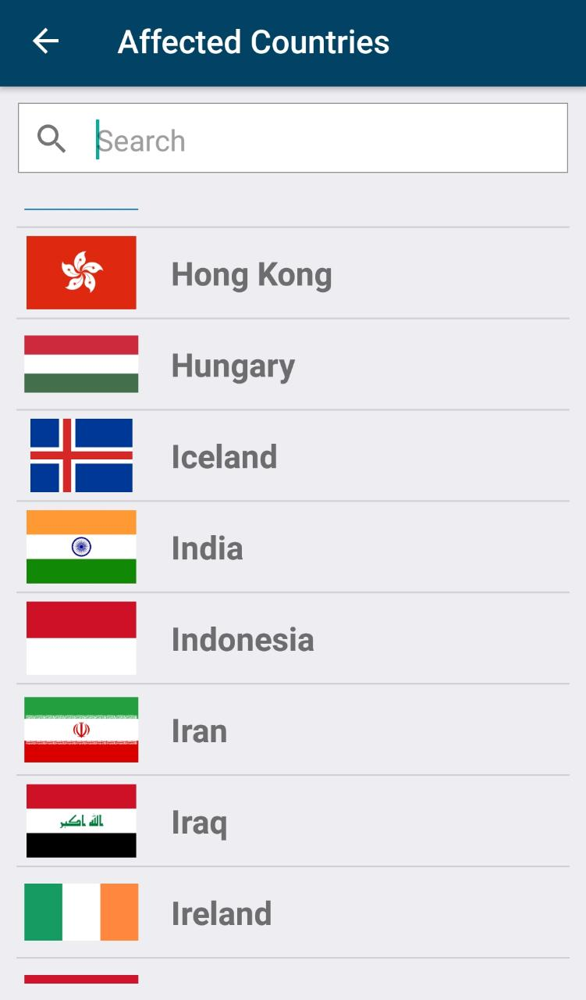
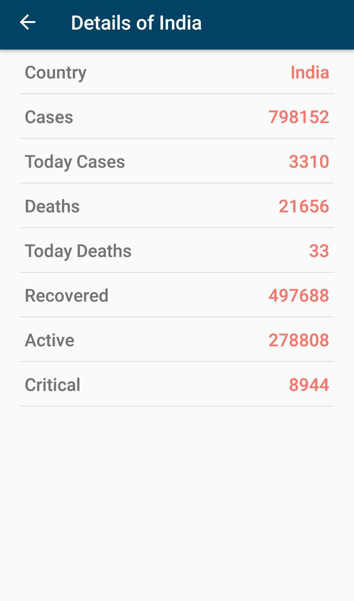

# Covid-19-Tracker-App
This is a corona tracker app which shows the corona related statistics for all countries .
This app is made using native android development using java as the base coding language.
This app uses https://corona.lmao.ninja/ API to get the JSON data and shows them appropriately in the application.

     

